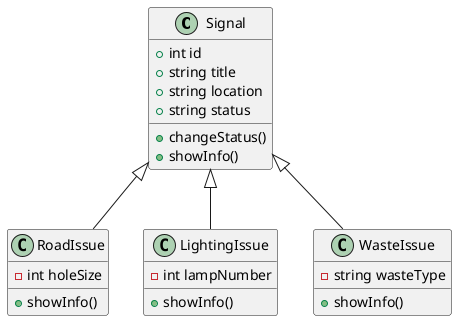

# VillageAlert

VillageAlert е малко конзолно приложение на C++ за подаване и проследяване на
граждански сигнали в малки населени места. Идеята е жителите да могат лесно да
докладват проблеми, а администрацията да следи статуса им на едно място.

## Проблемът

В малките села често има проблеми с инфраструктурата - дупки по пътищата,
неработещо улично осветление, незаконни сметища. Обикновено няма централно
място, където тези сигнали да се събират, затова реакцията е бавна и нищо не се
проследява. VillageAlert се опитва да реши точно това.

## Какво може приложението

- Подаване на сигнал от гражданин (пътен проблем, осветление или отпадъци)
- Преглед на всички подадени сигнали
- Промяна на статуса на сигнал (администраторска функция)
- Изтриване на сигнал

## Структура на проекта

```
ROEKT/
├── include/        хедъри (.h) с дефиниции на класовете
│   ├── Signal.h
│   ├── RoadIssue.h
│   ├── LightingIssue.h
│   └── WasteIssue.h
├── src/            имплементации (.cpp) + main.cpp
│   ├── Signal.cpp
│   ├── RoadIssue.cpp
│   ├── LightingIssue.cpp
│   ├── WasteIssue.cpp
│   └── main.cpp
└── README.md
```

## Компилиране и стартиране

```bash
g++ -std=c++14 -Iinclude src/*.cpp -o VillageAlert
./VillageAlert
```

## Как е устроен кодът

Проектът е писан с обектно-ориентиран подход и стъпва върху четирите основни
принципа - абстракция, наследяване, полиморфизъм и капсулация.

В основата стои базовият клас `Signal`, който пази общите данни за всеки сигнал
(`id`, `title`, `location`, `status`) и обявява `showInfo()` като виртуален
метод. Трите конкретни вида сигнали наследяват `Signal` и всеки сам решава как
да се покаже:

```
            Signal
          /    |    \
  RoadIssue  LightingIssue  WasteIssue
```

- `RoadIssue` - проблеми по пътищата, добавя `holeSize` (размер на дупката).
- `LightingIssue` - проблеми с осветлението, добавя `lampNumber`.
- `WasteIssue` - незаконни сметища, добавя `wasteType`.

## UML диаграма


